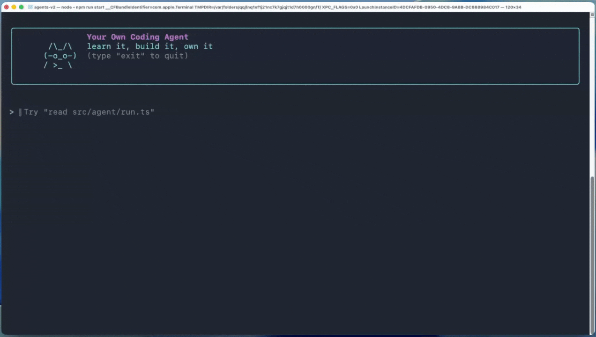

<p align="center">
  
</p>

# 从零构建生产级 AI Coding Agent

> *Learn it, build it, own it.*

[English](./README.en.md) | 简体中文

一份动手指南，带你从零实现一个 CLI AI coding agent —— 覆盖工具调用、流式输出、评测、文件与 Shell 工具、上下文与记忆管理、人工审批、可靠性与安全，以及 planning mode、subagents 等生产级架构模式。

这份指南从一个小而清晰的教学版 agent 架构开始，然后逐步靠近 OpenCode 和 Claude Code 这类真实 coding agent 的形态。

## 适合谁

- 想自己动手实现一个 coding agent、看懂每一层而不只是调 SDK 的工程师
- 准备 fork 或扩展生产级 agent（Claude Code、OpenCode）的团队，需要先建立能读懂源码的心智模型
- 已经会"调用 LLM"，但想补齐那些不性感却必须的生产细节：retries、cancellation、路径校验、评测和集成测试

## 快速开始

- 在线阅读：[从零构建生产级 AI Coding Agent](https://linzzzzzz.github.io/coding-agents-from-scratch/)
- 或直接在 GitHub 打开 [第 1 章](./typescript-zh/src/01-intro-to-agents.md)

## 参考实现

本指南对应的完整 TypeScript 代码放在 [`reference/typescript`](./reference/typescript)。

你可以用它对照自己的代码、排查章节问题，或者直接在本地运行完整 agent。

## 你会构建什么

一个 CLI coding agent，它能够：

- 在流式 agent loop 中通过结构化工具调用读写代码、执行 Shell 命令、搜索网页
- 通过上下文压缩和跨运行的持久化记忆，控制 token 预算
- 在执行破坏性操作前请求人工审批，并用路径校验和输出限制为每个工具兜底
- 通过 retries、cancellation、usage limits 和结构化日志在真实故障下保持可用
- 在执行复杂任务前先规划，并把子任务委派给专门的 subagents
- 内置单轮、多轮评测，以及面向真实工具的集成测试
- 兼容任意 OpenAI-compatible provider，不绑定单一厂商

<p align="center">
  
</p>

<p align="center"><em>TypeScript 参考实现中的终端 UI。</em></p>

## 指南目录

| 部分 | 章节 |
| --- | --- |
| **I. Agent 基础** | [第 1 章：AI Agent 入门](./typescript-zh/src/01-intro-to-agents.md) |
|  | [第 2 章：工具调用](./typescript-zh/src/02-tool-calling.md) |
|  | [第 3 章：单轮评测](./typescript-zh/src/03-single-turn-evals.md) |
|  | [第 4 章：Agent Loop](./typescript-zh/src/04-the-agent-loop.md) |
|  | [第 5 章：多轮评测](./typescript-zh/src/05-multi-turn-evals.md) |
| **II. 真实世界能力** | [第 6 章：文件系统工具](./typescript-zh/src/06-file-system-tools.md) |
|  | [第 7 章：网页搜索与上下文管理](./typescript-zh/src/07-web-search-context-management.md) |
|  | [第 8 章：Shell 工具与代码执行](./typescript-zh/src/08-shell-tool.md) |
|  | [第 9 章：Human-in-the-Loop](./typescript-zh/src/09-human-in-the-loop.md) |
| **III. 强化 Agent** | [第 10 章：从原型到产品](./typescript-zh/src/10-from-prototype-to-product.md) |
|  | [第 11 章：可靠性](./typescript-zh/src/11-reliability.md) |
|  | [第 12 章：记忆](./typescript-zh/src/12-memory.md) |
|  | [第 13 章：安全](./typescript-zh/src/13-security.md) |
|  | [第 14 章：工具系统与测试](./typescript-zh/src/14-tooling.md) |
| **IV. Agent 架构** | [第 15 章：Agent Planning](./typescript-zh/src/15-agent-planning.md) |
|  | [第 16 章：Subagents](./typescript-zh/src/16-subagents.md) |

## Roadmap

后续计划包括：

- Python 版本
- Session management
- MCP、plugins 和 skills

## 灵感与致谢

本项目受到以下项目启发：

- [sivakarasala/building-ai-agents](https://github.com/sivakarasala/building-ai-agents)
- [Hendrixer/agents-v2](https://github.com/Hendrixer/agents-v2)
- [OpenCode](https://opencode.ai/)
- [Claude Code](https://code.claude.com/docs/en/overview)

目标不是复制这些项目，而是用动手指南的方式拆解实用 coding agent 是怎么搭起来的。

## 本指南的特点

- 新增 planning mode、subagents、安全加固、记忆等章节
- 兼容任意 OpenAI-compatible provider，不绑定单一模型厂商
- 双语 mdBook 网站，支持 English / 简体中文 逐页切换
- 在学习过程中沉淀的设置说明完善与问题修复

主要差异可以查看 [Changes from Upstream](./CHANGES_FROM_UPSTREAM.md)。

## 本地构建网站

需要安装 [mdBook](https://rust-lang.github.io/mdBook/)。在 macOS 上可以用 Homebrew 安装：

```bash
brew install mdbook
./build.sh
```

如果你更喜欢 Cargo，也可以使用 `cargo install mdbook`。

构建完成后打开 `docs/index.html`。

## License

MIT
