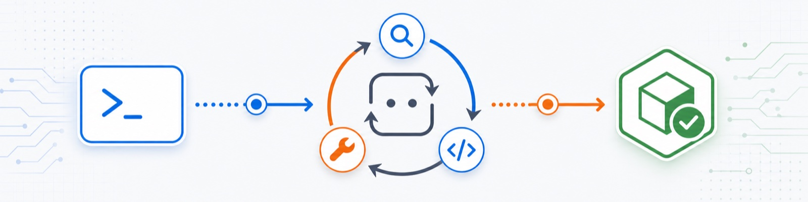

<p align="center">
  
</p>

# 从零构建生产级 AI Coding Agent

[English](./README.md) | 简体中文

一份动手指南，带你从零实现一个 CLI AI coding agent，覆盖工具调用、流式输出、评测、上下文管理、文件系统访问、Shell 执行、人工审批，以及面向生产环境的安全与可靠性模式。

这份指南从一个小而清晰的教学版 agent 架构开始，然后逐步靠近 OpenCode 和 Claude Code 这类真实 coding agent 的形态。

## 快速开始

从这里开始阅读：[从零构建生产级 AI Coding Agent](https://linzzzzzz.github.io/coding-agents-from-scratch/)。

也可以直接在 GitHub 打开 [第 1 章](./typescript-zh/src/01-intro-to-agents.md)。

## 你会构建什么

一个 CLI coding agent，可以：

- 使用 OpenAI-compatible LLM API 和结构化工具定义
- 流式输出回复，并在 agent loop 中执行工具
- 读取、写入、列出和删除文件
- 执行 Shell 命令和代码
- 搜索网页获取最新信息
- 通过 token 估算和压缩管理上下文窗口
- 在危险操作前请求人工审批
- 运行单轮和多轮评测
- 加入 retries、cancellation、usage limits 和 structured logging 等可靠性能力
- 持久化有用记忆，同时避免把每次运行都变成永久上下文
- 通过路径校验、工具结果隔离、输出限制和真实集成测试强化工具执行
- 加入 planning mode 和生产级 subagents，用来处理更大的 coding task

## 指南目录

| 部分 | 章节 |
| --- | --- |
| **I. Agent 基础** | [第 1 章：AI Agent 入门](./typescript-zh/src/01-intro-to-agents.md) |
|  | [第 2 章：结构化工具调用](./typescript-zh/src/02-tool-calling.md) |
|  | [第 3 章：单轮评测](./typescript-zh/src/03-single-turn-evals.md) |
|  | [第 4 章：流式 agent loop](./typescript-zh/src/04-the-agent-loop.md) |
|  | [第 5 章：多轮评测](./typescript-zh/src/05-multi-turn-evals.md) |
| **II. 真实世界能力** | [第 6 章：文件系统工具](./typescript-zh/src/06-file-system-tools.md) |
|  | [第 7 章：网页搜索与上下文管理](./typescript-zh/src/07-web-search-context-management.md) |
|  | [第 8 章：Shell 工具与代码执行](./typescript-zh/src/08-shell-tool.md) |
|  | [第 9 章：人工审批流程](./typescript-zh/src/09-human-in-the-loop.md) |
| **III. 强化 Agent** | [第 10 章：从原型到产品](./typescript-zh/src/10-from-prototype-to-product.md) |
|  | [第 11 章：可靠性与结构化日志](./typescript-zh/src/11-reliability.md) |
|  | [第 12 章：记忆](./typescript-zh/src/12-memory.md) |
|  | [第 13 章：安全强化](./typescript-zh/src/13-security.md) |
|  | [第 14 章：工具系统、编排与真实测试](./typescript-zh/src/14-tooling.md) |
| **IV. Agent 架构** | [第 15 章：Agent Planning](./typescript-zh/src/15-agent-planning.md) |
|  | [第 16 章：Subagents](./typescript-zh/src/16-subagents.md) |

## Roadmap

后续计划包括：

- Python 版本
- Session management
- MCP、plugins 和 skills

## 灵感与致谢

本项目受到以下项目启发：

- [sivakarasala/building-ai-agents](https://github.com/sivakarasala/building-ai-agents)
- [Hendrixer/agents-v2](https://github.com/Hendrixer/agents-v2)
- [OpenCode](https://opencode.ai/)
- [Claude Code](https://code.claude.com/docs/en/overview)

目标不是复制这些项目，而是用动手指南的方式讲清楚实用 coding agent 背后的架构，并补充更多生产环境相关主题、OpenAI-compatible provider 支持、更清晰的说明、问题修复和新的网页体验。

## 本指南的特点

- 把教学版 agent 架构扩展到更接近 OpenCode 和 Claude Code 这类生产级 coding agent 的方向
- 支持 OpenAI-compatible provider，而不是假设只使用单一模型厂商
- 增加更清晰的设置说明、细节解释，并修复学习过程中发现的小问题
- 加深上下文管理、工具安全、Shell 执行、人工审批、评测和生产准备相关内容
- 更新网站和指南定位，让项目在保留致谢的同时拥有自己的表达

主要差异可以查看 [Changes from Upstream](./CHANGES_FROM_UPSTREAM.md)。

## 本地开发

需要安装 [mdBook](https://rust-lang.github.io/mdBook/)。在 macOS 上可以用 Homebrew 安装：

```bash
brew install mdbook
./build.sh
```

如果你更喜欢 Cargo，也可以使用 `cargo install mdbook`。

构建完成后打开 `docs/index.html`。

## License

MIT
